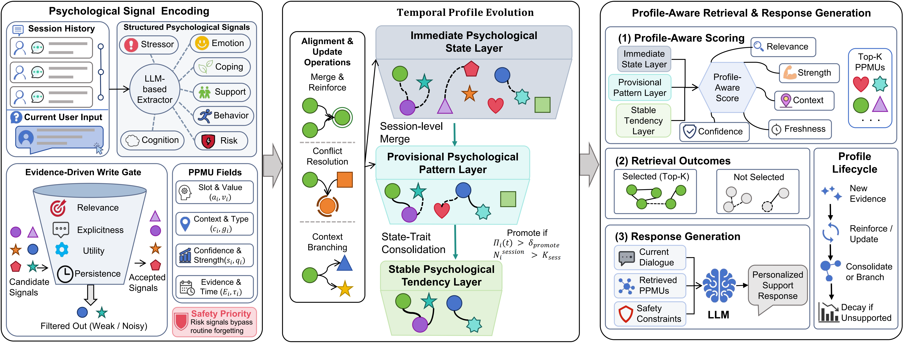

# TPPM: Temporal Psychological Profile Memory for Long-Term Mental Health Support

<div align="center">

[](https://www.python.org/)
[](LICENSE)

</div>

## Abstract

Psychological support dialogues are inherently multi-session and longitudinal, requiring systems to continuously understand users' emotional states, stressors, coping strategies, and relatively stable psychological tendencies. Existing long-context and retrieval-augmented generation (RAG) methods store historical dialogues as static text, making it difficult to form updatable psychological profiles. Recent agent memory approaches improve retention of long-term facts but lack explicit modeling of short-term psychological states, long-term traits, and their contextual dependencies.

**Temporal Psychological Profile Memory (TPPM)** models long-term psychological support as two coupled processes: *profile state evolution* and *profile-conditioned generation*. TPPM organizes psychological information across three temporal tiers — **Immediate State**, **Phasic Pattern**, and **Stable Tendency** — using structured Psychological Profile Memory Units (PPMUs). Key mechanisms include: evidence-driven **state-to-trait consolidation**, **context-conditional branching**, **type-conditioned decay**, and **profile-aware retrieval**.

TPPM is evaluated on PersonaMem (dynamic profile modeling), LoCoMo (long-range dialogue memory), and PsyDial (psychological support quality), achieving competitive overall performance with particular strengths in preference evolution tracking, cross-session integration, cross-scenario generalization, and context-aware supportive response generation.

## Framework Overview

<p align="center">
  
</p>
<p align="center">
  <em>TPPM architecture overview. Psychological signals are extracted from dialogue, filtered through write gating, and organized across three temporal tiers via alignment, contextual branching, state–trait consolidation, and type-conditioned decay. Profile-aware retrieval selects relevant memories for context-conditioned generation.</em>
  &nbsp;[<a href="assets/tppm_architecture.pdf">PDF version</a>]
</p>

## Highlights

- **Three-tier temporal psychological representation** — Immediate State, Phasic Pattern, and Stable Tendency layers organize information at different time scales, inspired by working/episodic/semantic memory distinctions and state–trait theory
- **Structured PPMU** — Each memory unit carries 8 fields (slot, value, context, type, strength, confidence, evidence set, timestamps), enabling both LLM readability and rule-driven evolution
- **State-to-trait consolidation** — Cross-turn and cross-session evidence promotes recurring phasic patterns into stable tendencies via dual-condition gating
- **Context-conditional branching** — Contradictory expressions across life scenarios (home vs. work) are preserved as context branches rather than overwritten
- **Type-conditioned decay** — Different psychological dimensions decay at different rates; risk signals are exempt from routine decay under safety-first rules
- **Profile-aware retrieval** — Five-factor scoring (semantic relevance, memory strength, context match, temporal freshness, extraction confidence) for memory selection

## Installation

```bash
git clone https://github.com/Futr1/TPPM.git
cd TPPM

python -m venv .venv
source .venv/bin/activate        # Linux/macOS
# .venv\Scripts\Activate.ps1     # Windows PowerShell

python -m pip install -U pip
pip install -e .
```

For development dependencies:

```bash
pip install -e ".[dev]"
```

## Datasets

Datasets are not distributed with this repository. Download from official sources and place under `data/datasets/`.

| Dataset | Local Path | Source |
|---------|-----------|--------|
| **PersonaMem** | `data/datasets/personamem/` | [GitHub](https://github.com/bowen-upenn/PersonaMem) |
| **LoCoMo** | `data/datasets/locomo/` | [GitHub](https://github.com/snap-research/LoCoMo) |
| **PsyDial** | `data/datasets/psydial/` | [GitHub](https://github.com/qiuhuachuan/PsyDial) |

See `data/README.md` for path migration and [THIRD_PARTY_LICENSES.md](THIRD_PARTY_LICENSES.md) for license details.

## Quick Reproduction

The baseline configuration matches the paper-reported hyperparameters (write_threshold=0.68, promote_threshold=0.72, context_threshold=0.62, promotion_min_sessions=2).

### 1. Environment

```bash
REPO_ROOT="$(git rev-parse --show-toplevel)"
export DEEPSEEK_API_KEY="your-api-key"
```

### 2. Verify Installation

```bash
cd "$REPO_ROOT"
python3 -c "from tppm.core.memory import TemporalProfileMemory, TPMConfig; print('TPM module OK')"

pytest tests/test_paper_configuration.py -q
```

### 3. PersonaMem

```bash
cd "$REPO_ROOT/benchmarks/personamem"

python3 scripts/phase1_extract_candidates.py

python3 scripts/phase2_replay_evolution.py --config-id baseline

python3 scripts/phase3_eval_qa.py --config-id baseline --backend deepseek

python3 scripts/summarize.py
```

### 4. LoCoMo

```bash
cd "$REPO_ROOT/benchmarks/locomo"

python3 scripts/locomo_tppm_extract.py

python3 scripts/locomo_qa_eval.py

python3 scripts/locomo_event_eval.py
```

### 5. PsyDial

```bash
cd "$REPO_ROOT/benchmarks/psydial"

python3 scripts/tppm_extract_d101.py

python3 scripts/generate_responses.py

python3 scripts/llm_judge_scoring.py
```

### 6. Ablation

```bash
cd "$REPO_ROOT/benchmarks/personamem"

# Run with an ablation config (example)
python3 scripts/phase2_replay_evolution.py --config-id ablation_consolidation
python3 scripts/phase3_eval_qa.py --config-id ablation_consolidation --backend deepseek
python3 scripts/summarize.py
```

See [Main Reproduction Configurations](#main-reproduction-configurations) for all config IDs.

## Main Reproduction Configurations

### Core Configuration

All parameters from `TPMConfig` (`src/tppm/core/memory.py`) and `configs/paper/baseline.yaml`:

| Parameter | Paper baseline |
|-----------|---------------|
| Write threshold | 0.68 |
| Promote threshold | 0.72 |
| Context threshold | 0.62 |
| Minimum sessions for promotion | 2 |
| Top-K retrieval | 5 |
| Write weights | (0.25, 0.30, 0.25, 0.20) |
| Retrieve weights | (0.35, 0.20, 0.15, 0.20, 0.10) |
| Base generation model | DeepSeek-V4-Flash |
| LLM Judge model | DeepSeek-V4-Pro |

Type-specific decay lambdas are implementation defaults, not individually reported in the paper. They maintain the ordering λ_affect > λ_stressor > λ_coping ≈ λ_support > λ_trait.

### Benchmark Entries

| Benchmark | Directory | Main scripts |
|-----------|-----------|-------------|
| PersonaMem | `benchmarks/personamem/` | `phase1_extract_candidates.py`, `phase2_replay_evolution.py`, `phase3_eval_qa.py`, `summarize.py` |
| LoCoMo | `benchmarks/locomo/` | `locomo_tppm_extract.py`, `locomo_qa_eval.py`, `locomo_event_eval.py` |
| PsyDial | `benchmarks/psydial/` | `tppm_extract_d101.py`, `generate_responses.py`, `llm_judge_scoring.py` |

### Ablation Configurations

From `configs/ablations/` (split from the original monolithic YAML):

| Config ID | Mechanism |
|-----------|-----------|
| `baseline` | Full TPPM (paper hyperparameters) |
| `ablation_consolidation` | w/o State→Trait Consolidation |
| `ablation_branching` | w/o Context-Conditional Branching |
| `ablation_decay` | w/o Temporal Decay |
| `ablation_uniform_decay` | w/o Type-Conditioned Decay (uniform rates) |
| `ablation_semantic_retrieval` | Semantic-Only Retrieval (reuses baseline snapshots) |
| `ablation_flat_pool` | Flat PPMU Pool (no tiers) |
| `ablation_two_level` | Two-Level Memory (merged working+short) |

The "w/o Evidence Set" variant is implemented via post-processing (`benchmarks/ablations/scripts/psydial_ablation_banks.py`) rather than a YAML config entry.

## Main Code Path

1. **Extraction** — `src/tppm/core/extractor.py` → LLM or regex-based candidate extraction
2. **Write gating** — `TemporalProfileMemory.ingest()` → scores and filters candidates
3. **Alignment & branching** — `TemporalProfileMemory._align_and_merge()` → matches against existing PMUs, creates context branches
4. **Turn decay** — `TemporalProfileMemory._decay_working()` → per-turn exponential decay
5. **Retrieval** — `TemporalProfileMemory.retrieve()` → five-factor scoring, Top-K selection
6. **Session-end consolidation** — `TemporalProfileMemory.finish_session()` → working→short promotion, short→long consolidation
7. **Generation** — Base LLM receives retrieved memories + conversation history

## Output Artifacts

All run artifacts are written to `runs/<benchmark>/<run-id>/`. Summary metrics go to `result/`.

Previously generated local outputs may use legacy configurations (e.g., promote_threshold=0.58).

## Notes

- API model versions may produce different results over time as the underlying service is updated
- LLM Judge scoring has inherent stochasticity
- Full experiments incur non-trivial API costs
- Datasets are subject to their original licenses (see [THIRD_PARTY_LICENSES.md](THIRD_PARTY_LICENSES.md) and [third_party/README.md](third_party/README.md))
- Large output files and third-party datasets are excluded from Git via `.gitignore`

## Privacy, Ethics, and Safety

Psychological profiles constitute highly sensitive personal data. Any real-world deployment must:

- Obtain **explicit, informed user consent** before collecting or maintaining profiles
- Apply **data minimization** — retain only necessary psychological information
- Use **encryption at rest and in transit** for stored PPMUs
- Provide **user data export and deletion** mechanisms

TPPM is a **supportive memory module**, not a replacement for professional psychological counseling or clinical diagnosis. The system does not perform clinical assessment, diagnosis, or treatment. In high-risk scenarios (self-harm, harm to others, severe crises), the system should **escalate to human intervention**.

Deploy only after safety evaluation in the specific deployment context, with human-in-the-loop oversight for high-stakes interactions. Audit for biases in psychological profile extraction across demographic groups and consider cultural differences in psychological expression and interpretation.

## License

Original TPPM code is licensed under the MIT License. See [LICENSE](LICENSE).

Third-party components remain subject to their original licenses. See [THIRD_PARTY_LICENSES.md](THIRD_PARTY_LICENSES.md).
